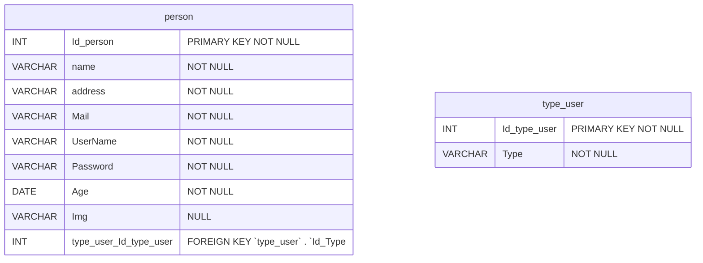

# Databases
## Index

| Database      | Location                               |
| ------------- | ---------------------------------------|
| Users         | [USERSDB](#users-database) |

## Users database
### E/R model


### Relations


### Script

This script is located in [UserDatabase](https://github.com/MaxiDrive/Docs/tree/docs/Diagrams/DatabaseEdit/Users/Scripts)
 
#### Tables Create
```sql
-- -----------------------------------------------------
-- Table `maxiusers`.`type_user`
-- -----------------------------------------------------
CREATE TABLE IF NOT EXISTS `maxiusers`.`type_user` (
  `Id_type_user` INT NOT NULL AUTO_INCREMENT,
  `Type` VARCHAR(50) NOT NULL,
  PRIMARY KEY (`Id_type_user`))
ENGINE = InnoDB
DEFAULT CHARACTER SET = utf8mb4
COLLATE = utf8mb4_0900_ai_ci;

-- -----------------------------------------------------
-- Table `maxiusers`.`person`
-- -----------------------------------------------------
CREATE TABLE IF NOT EXISTS `maxiusers`.`person` (
  `Id_person` INT NOT NULL AUTO_INCREMENT,
  `Name` VARCHAR(50) NOT NULL,
  `Address` VARCHAR(50) NOT NULL,
  `Mail` VARCHAR(50) NOT NULL,
  `UserName` VARCHAR(45) NOT NULL,
  `Password` VARCHAR(300) NOT NULL,
  `Age` DATE NOT NULL,
  `Img` VARCHAR(100) NULL,
  `type_user_Id_type_user` INT NOT NULL,
  PRIMARY KEY (`Id_person`),
  INDEX `fk_person_type_user_idx` (`type_user_Id_type_user` ASC) VISIBLE,
  CONSTRAINT `fk_person_type_user`
    FOREIGN KEY (`type_user_Id_type_user`)
    REFERENCES `maxiusers`.`type_user` (`Id_type_user`)
    ON DELETE NO ACTION
    ON UPDATE NO ACTION)
ENGINE = InnoDB
DEFAULT CHARACTER SET = utf8mb4
COLLATE = utf8mb4_0900_ai_ci;
```
